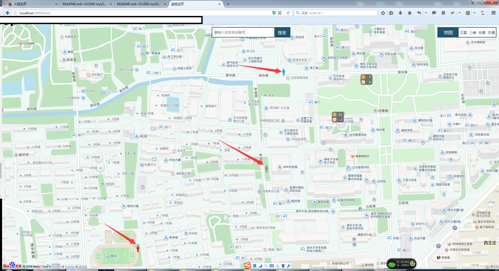
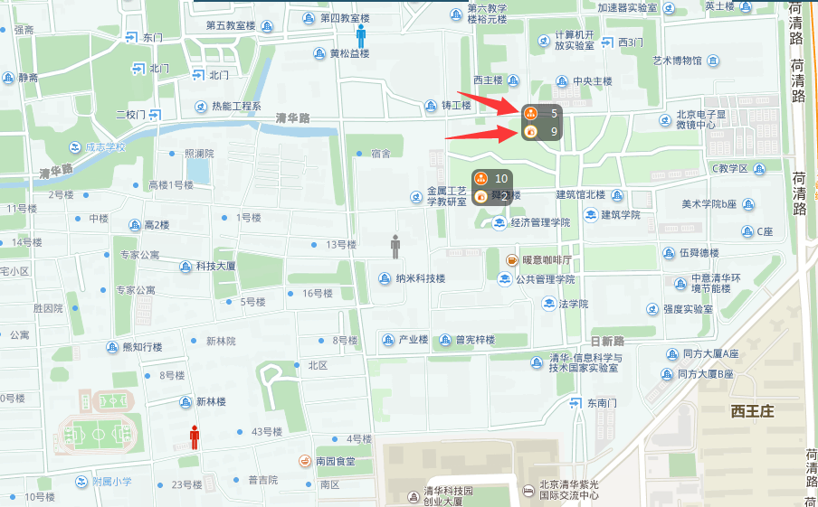
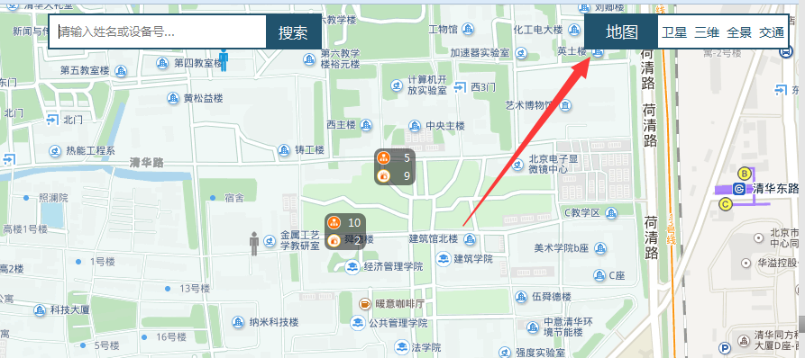
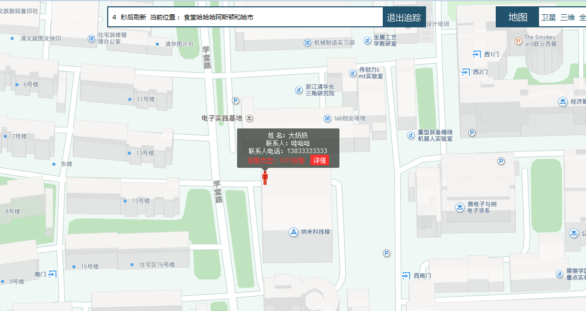
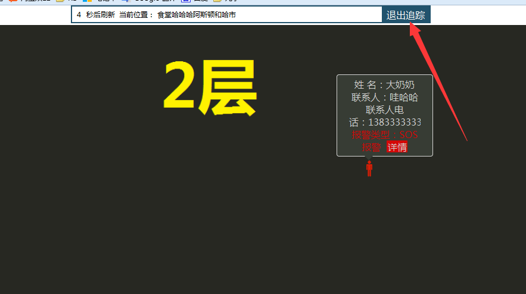
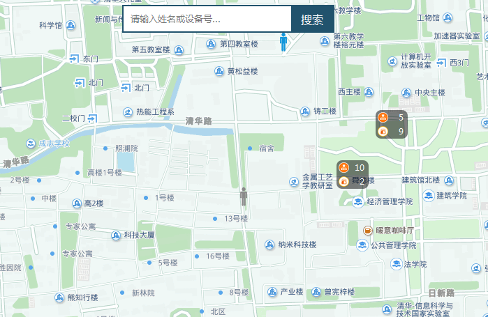
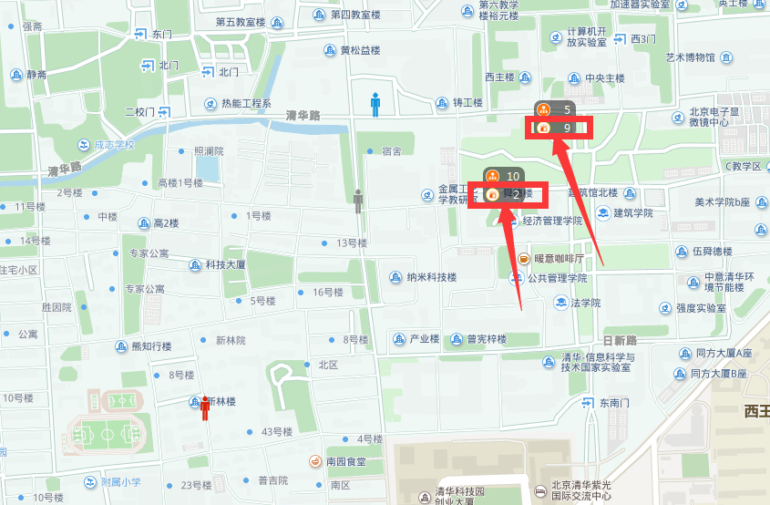
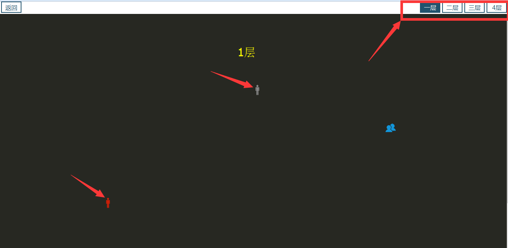
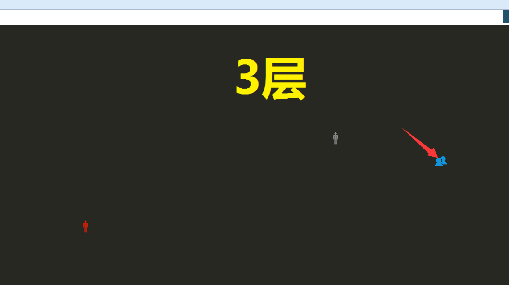
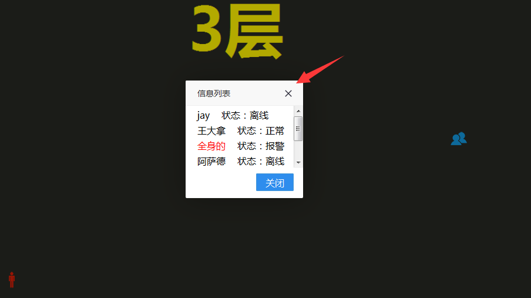

## 运行

* git pull 下来后，先下载包;

* 运行 gulp test;

* 在端口号后输入 /html/

-----------------------------------------------

## 项目说明

* 此项目实行了室内追踪模式的前端。使用的是百度API，和layer的弹窗
* 室外监控：箭头处的小人和页面上的黑色半透明框（地图上楼宇）为实时数据。
* 室外人的监控：根据人的状态数据不同来展示不同状态图片，位置实时更新。

* 室外楼宇的监控：半透明框上排的数据为报警数据，下排数据为楼内的人的数量

* 右上角为自定义的工具栏      [自定义百度工具栏](https://github.com/zc3hd/demo_BDmap_in-out_change/blob/master/webapp/script/module/monitor/map_diyTools.js)

* 点击室外人的marker进入追踪模式，因为数据为实时的，所以人有可能会在室内或室外，室内外地图进行切换，代码部分为层级的切换。
    - 室内追踪
    
    - 室外追踪
    
    - 代码部分
```
    function(id){
        var me = this;
          // 数据为模拟数据
          var out_point = {
            "lng": 116.335452 + 0.001 * (Math.random() > 0.5 ? Math.random() : -Math.random()),
            "lat": 40.004517 + 0.001 * (Math.random() > 0.5 ? Math.random() : -Math.random()),
          };
          var in_point = {
            "x": 56 + 10 * (Math.random() > 0.5 ? Math.random() : -Math.random()) + '%',
            "y": 23 + 10 * (Math.random() > 0.5 ? Math.random() : -Math.random()) + '%',
          };
          var data = {
            "id": 5,
            "name": "大奶奶",
            "tel_name": "哇哈哈",
            "tel": "13833333333",
            point: null,
            pos: '食堂哈哈哈阿斯顿和哈市',
            "flag": 2,
            "alarm_info": 'SOS报警',
            // key:0室外 1 室内
            "key": (1000 * Math.random()) > 500 ? 0 : 1,
            //"key": 1,
            'src': '../images/u170.jpg',
          };


          // 先进行室内外判断
          // 室外
          if (data.key == 0) {
            $('#inside').css('zIndex', '999');

            //框的切换 
            $('#ipt_map').hide();
            $('#trail_map').show();

            me.map_clear_Pointer();
            data.point = out_point;
            var marker = me.m_man_make(data);
            me.map.addOverlay(marker);
            var pt = new BMap.Point(data.point.lng, data.point.lat);
            me.map.setViewport([pt]);
          }
          // 室内
          else if (data.key == 1) {
            // 提高室内图的层级
            $('#inside').css('zIndex', '1001');
            data.point = in_point;
            $('#in_img').attr('src', data.src);

            $('#in_img').unbind().on('load', function() {

              $('#in_table_contain').hide();
              $('#in_trail_map').show();
              me.in_out_trail_make(data);
            })
          }
    }
```

* 退出追踪，因进入追踪模式是从室外监控进入的，所以退出时，为室外监控。清除个人追踪的定时器。


* 搜索模式：和点击一个人进入追踪模式相同。是特定搜索某个人的信息。

* 室内监控：点击室外楼宇信息下排的数据进入

* 进入页面后先进行室内地图加载，加载完成后再进行室内打点，室内打点为 top 和 left，室内点为实时

* 从室内点击个人，进入追踪模式，实时数据为室内或室外，退出追踪模式时，界面为当前进入的室内监控界面。
* 点击多人图标弹出多人信息列表，列表信息为人名和当前状态。点击人的名字进入追踪模式
 
 

Browsersync works by injecting an asynchronous script tag (`<script async>...</script>`) right after the `<body>` tag
during initial request. In order for this to work properly the `<body>` tag must be present. Alternatively you
can provide a custom rule for the snippet using 

## Upgrading from 1.x to 2.x ?
Providing you haven't accessed any internal properties, everything will just work as
 there are no breaking changes to the public API. Internally however, we now use an
 immutable data structure for storing/retrieving options. So whereas before you could access urls like this...

```js
browserSync({server: true}, function(err, bs) {
    console.log(bs.options.urls.local);
});
```

... you now access them in the following way:

```js
browserSync({server: true}, function(err, bs) {
    console.log(bs.options.getIn(["urls", "local"]));
});
```

## Install and trouble shooting

[browsersync.io docs](http://browsersync.io)

## Integrations / recipes

[Browsersync recipes](https://github.com/Browsersync/recipes)

## Support

If you've found Browser-sync useful and would like to contribute to its continued development & support, please feel free to send a donation of any size - it would be greatly appreciated!

[](https://www.gittip.com/shakyshane)
[](https://www.paypal.com/cgi-bin/webscr?cmd=_donations&business=shakyshane%40gmail%2ecom&lc=US&item_name=browser%2dsync)


Apache 2
Copyright (c) 2016 Shane Osbourne
